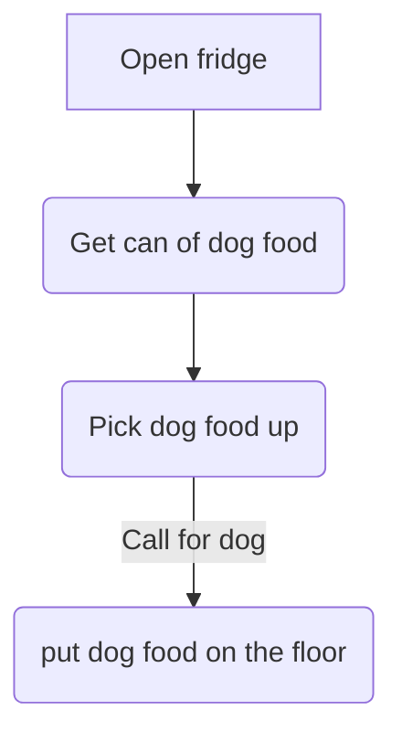
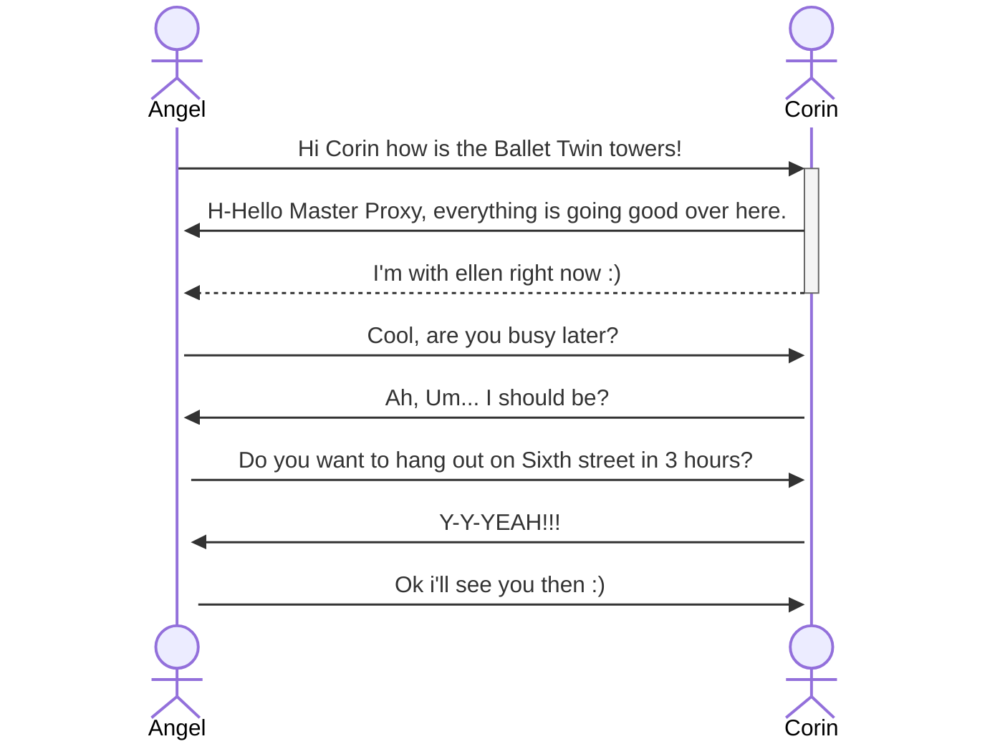

# My-dog-Bubbles.github.io
Angel Carmichael amcarmichael2@my.waketech.edu
Github acount: Bob the builder. CAN HE FIX IT!!!!!
Repostory: Don't forget the readme
I went to the ddesktop github. Pressed the 3 lines then clicked clone. The checked the location.
# About Me
## **_My Interest_**
### Animals
* Dogs
* ~~wolves~~
* Baby hippo
* Marcus
* Bianca

### Top 10 Colors
* Light Blue
* Patel blue
* pastel pink
* Cyan
* Yellow
* caramel machiato
* evergreen
* Red Magenta
* Dark purple
* orange

### To-do list
* [] walk my dog
* [] Play it's Friday
* [x] Drink tea
* [x] Brush teeth
* [] Take Cti module 6 quiz
* [x] Get in the spooky mood
* [x] Talk about Halloween costumes
* [] Go home
* [] Eat dinner
* [x] Make sure window 10 will load

### Interesting websites
1. [Slither.io](http://slither.com/io)
    * A fun game where you are a snake eating orbs to get bigger. I like it is never ending.
2. [Bob the builder theme song](https://www.youtube.com/watch?v=HdVg-2jn2OU)
    * It a song from my childhood. This song comes from a show abouut a guy who fixes things.
3. [It's friday song](https://www.youtube.com/watch?v=kfVsfOSbJY0)
* The song I play every Friday. I like to play this song to hype everyone up for the weekend.

## My Mermaid Chart
### How to Feed a Dog

### Phone call with Corin from ZZZ

